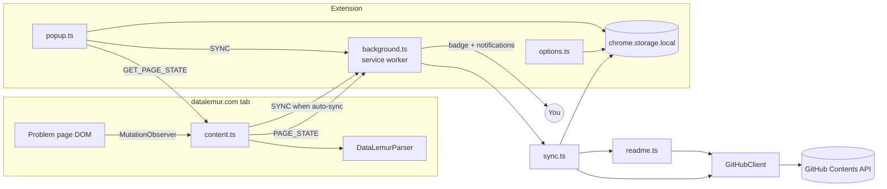

<<<<<<< HEAD
# DataLemur_ChromeExtension
=======
# DataLemur Sync

A Manifest V3 Chrome extension that pushes your accepted [DataLemur](https://datalemur.com)
SQL solutions straight into a GitHub repository — no backend, no third-party service.
Your token stays in Chrome storage and the only host the extension talks to is `api.github.com`.

```
Easy/Histogram of Tweets.sql
Medium/Users Third Transaction.sql
Hard/Card Launch Success.sql
README.md          ← regenerated on every sync
```

## Screenshots

| Popup                                                            | Settings                           |
| ---------------------------------------------------------------- | ---------------------------------- |
| _`assets/screenshots/popup.png` — replace with your own capture_ | _`assets/screenshots/options.png`_ |

## Features

- Activates only on `https://datalemur.com/questions/...`
- Extracts problem title, difficulty and the SQL in the editor with selector-tolerant parsing
  (CodeMirror 5/6, Monaco, Ace and plain textareas are all supported)
- Detects an accepted verdict via `MutationObserver` and shows **✓ Ready to Sync** plus a toolbar badge
- One-click **Sync**, with **Preview** showing the exact file that will be committed
- Optional **auto-sync** the moment a submission is accepted
- Files land in `Easy/`, `Medium/` or `Hard/`; existing files are updated in place (correct SHA
  handling), never duplicated
- `README.md` in the target repo is regenerated after every sync with totals and a solutions table
- Progress panel: total solved, per-difficulty counts and last sync time
- Chrome notifications for success, "already exists", and every failure mode
- Developer logging (`[DataLemur Sync] …`) behind a settings toggle
- Light and dark themes, keyboard-focusable, responsive popup

## Installation

1. **Build it**

   ```bash
   npm install
   npm run build
   ```

2. **Load it** — open `chrome://extensions`, enable **Developer mode**, click
   **Load unpacked** and select the generated `dist/` folder.

3. **Create a GitHub token**
   - Classic: <https://github.com/settings/tokens> → scope **`repo`**
   - Fine-grained: <https://github.com/settings/personal-access-tokens> → repository access limited
     to your solutions repo, permission **Contents: Read and write**

4. **Configure** — the options page opens on first install (or right-click the icon → _Options_).
   Enter the token, your username, the repository name and its default branch, then hit
   **Test connection**. The repository must already exist and have at least one commit.

5. **Use it** — solve a question on DataLemur, submit, and the toolbar badge turns into ✓.
   Open the popup and press **Sync**.

## Usage notes

- **Sync before acceptance** is allowed — the popup warns you but does not block it, which is
  useful when a site UI change makes verdict detection miss.
- **Re-syncing** an unchanged solution commits nothing and reports _Already exists_.
- **Progress counts** are stored locally. They describe what this browser has synced, not what is
  in the repository; _Reset progress_ in settings clears them without touching GitHub.

## Development

```bash
npm run dev      # Vite dev server with HMR for the popup/options pages
npm run build    # icons + typecheck + production bundle into dist/
npm test         # self-check over path building, README rendering, Base64, error mapping
npm run lint     # ESLint
npm run format   # Prettier
```

`npm run dev` still requires the extension to be loaded from `dist/`; run a build once first,
then keep the dev server running for fast UI iteration.

### Project layout

```
src/
  background/    service worker — the only code that touches the GitHub API
  content/       page watcher: parses the problem, observes the verdict
  popup/         toolbar UI
  options/       settings UI
  github/        REST client, sync orchestration, README generation, errors, Base64
  parsers/       SiteParser interface + per-site implementations
  storage/       Chrome Storage wrapper
  utils/         DOM helpers, editor reader, logger, constants, types
  styles/        shared design tokens
scripts/         icon generator (no image dependency)
```

### Architecture



The rule that keeps this honest: **only the service worker holds the token**. The content script
runs in a hostile page and never sees credentials; the popup reads settings only to display the
repository name.

### Adding another site

1. Implement `SiteParser` (`src/parsers/SiteParser.ts`) — `matches`, `parse`, `isAccepted`.
   `readEditorText()` and `hasAcceptedVerdict()` already cover most sites.
2. Register the class in `src/parsers/index.ts`.
3. Add the origin to `content_scripts.matches` and `host_permissions` in `manifest.json`.

Nothing else changes: storage, sync, README generation and the UI are site-agnostic.

## Error handling

| Situation                           | What you see                                                      |
| ----------------------------------- | ----------------------------------------------------------------- |
| Token missing / incomplete settings | _Open Settings and add your GitHub token…_                        |
| 401                                 | _Invalid or expired GitHub token._                                |
| 404                                 | _Repository not found. Check the username, repo name and branch._ |
| 403 with quota left                 | _Permission denied. The token needs the `repo` scope._            |
| 403/429 with quota exhausted        | _GitHub rate limit reached._                                      |
| 409/422 SHA mismatch                | Automatically refetches the SHA and retries once                  |
| Offline / DNS failure               | _Network error._ Request is retried 3× with exponential backoff   |
| 5xx                                 | Retried 3× with exponential backoff, then reported                |

A README update that fails never fails the sync — the solution file is already committed.

## Testing

`npm test` covers the pure logic. Browser behaviour is covered by the manual checklist in
[docs/TESTING.md](docs/TESTING.md).

## Roadmap

- LeetCode, HackerRank and StrataScratch parsers (the interface is already in place)
- Commit batching / single commit per session via the Git Trees API
- Per-problem notes and runtime stats in the file header
- Optional gist target for people without a dedicated repo
- Import existing repository contents to seed local progress counts

## Contributing

See [CONTRIBUTING.md](CONTRIBUTING.md).

## Privacy & security

- The token is written to `chrome.storage.local` only — never `storage.sync`, never a remote server.
- The token is never logged, never sent to the content script, and never placed in a URL.
- `host_permissions` are limited to `datalemur.com` and `api.github.com`.
- No analytics, no telemetry, no remote code.

## License

MIT
>>>>>>> e094182 (All the necessary local changes wrt to extension)
