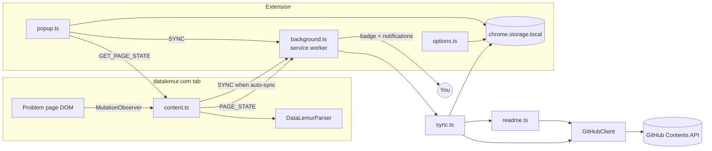

<p align="center">
  
</p>

<h1 align="center">DataLemur Sync</h1>

<p align="center">
  <strong>🔥 Ship your DataLemur SQL grind straight to GitHub — no server, no dependencies, just your token and the API.</strong>
</p>

<p align="center">
  
  
  
  
  
</p>

---

A **Manifest V3 Chrome extension** that watches your [DataLemur](https://datalemur.com) SQL submissions, detects accepted verdicts in real time, and pushes solutions into a GitHub repository — organised by difficulty, with an auto-generated README. Your token stays in `chrome.storage.local` and the only host the extension talks to is `api.github.com`.

```
📂 your-solutions-repo/
├── Easy/
│   └── Histogram of Tweets.sql
├── Medium/
│   └── Users Third Transaction.sql
├── Hard/
│   └── Card Launch Success.sql
└── README.md          ← regenerated on every sync
```

## ✨ Features

| | Feature | Details |
|---|---|---|
| 🎯 | **Smart Detection** | Activates only on `datalemur.com/questions/...` — never fires on unrelated pages |
| 🔍 | **Universal Editor Support** | Extracts SQL from CodeMirror 5/6, Monaco, Ace, and plain `<textarea>` with selector-tolerant parsing |
| ✅ | **Verdict Tracking** | Detects accepted submissions via `MutationObserver` and shows **✓ Ready to Sync** with a toolbar badge |
| ⚡ | **One-Click or Zero-Click Sync** | Manual **Sync** button with a live **Preview**, or enable **auto-sync** to commit the moment you pass |
| 📁 | **Difficulty-Sorted Organisation** | Solutions land in `Easy/`, `Medium/`, or `Hard/` — existing files are updated in place (SHA-aware), never duplicated |
| 📊 | **Auto-Generated README** | `README.md` in your target repo is regenerated after every sync with totals and a solutions table |
| 📈 | **Progress Dashboard** | Total solved, per-difficulty counts, and last sync time — all in the popup |
| 🔔 | **Chrome Notifications** | Toast for success, "already exists", and every failure mode |
| 🌗 | **Light & Dark Themes** | Keyboard-focusable, responsive popup with full theme support |
| 🛠️ | **Developer Logging** | Verbose `[DataLemur Sync] …` console logging behind a settings toggle |

## 🛠️ Tech Stack

| Layer | Technology |
|-------|-----------|
| **Language** | TypeScript 5.7 (strict) |
| **Build** | Vite 7 + `@crxjs/vite-plugin` |
| **Extension API** | Chrome Manifest V3 |
| **Linting** | ESLint + Prettier |
| **Testing** | Custom self-check suite (esbuild + Node `assert`) |
| **Runtime deps** | **Zero** — ships no third-party code |

## 🚀 Getting Started

### Prerequisites

- **Node.js** ≥ 18
- **npm** ≥ 9
- A **GitHub repository** (already created, with at least one commit)
- A **GitHub Personal Access Token** — [Classic](https://github.com/settings/tokens) with `repo` scope, or [Fine-grained](https://github.com/settings/personal-access-tokens) with **Contents: Read and write**

### Installation

1. **Clone & Build**

   ```bash
   git clone https://github.com/<your-username>/DataLemur_ChromeExtension.git
   cd DataLemur_ChromeExtension
   npm install
   npm run build
   ```

2. **Load the Extension** — open `chrome://extensions`, enable **Developer mode**, click **Load unpacked** and select the generated `dist/` folder.

3. **Configure** — the options page opens automatically on first install (or right-click the icon → _Options_). Enter your token, GitHub username, repository name, and default branch, then hit **Test connection**.

4. **Solve & Sync** — solve a question on DataLemur, submit, and the toolbar badge turns into ✓. Open the popup and press **Sync**.

## 💡 Usage Notes

- **Sync before acceptance** is allowed — the popup warns you but does not block it, useful when a site UI change makes verdict detection miss.
- **Re-syncing** an unchanged solution commits nothing and reports _Already exists_.
- **Progress counts** are stored locally. They describe what this browser has synced, not what is in the repository; _Reset progress_ in settings clears them without touching GitHub.

## 🏗️ Architecture

### Project Layout

```
src/
  background/    service worker — the only code that touches the GitHub API
  content/       page watcher: parses the problem, observes the verdict
  popup/         toolbar UI
  options/       settings UI
  github/        REST client, sync orchestration, README generation, errors, Base64
  parsers/       SiteParser interface + per-site implementations
  storage/       Chrome Storage wrapper
  utils/         DOM helpers, editor reader, logger, constants, types
  styles/        shared design tokens
scripts/         icon generator (no image dependency)
```

### System Diagram



> **Security invariant:** Only the service worker holds the token. The content script runs in a hostile page and never sees credentials; the popup reads settings only to display the repository name.

## 🔌 Extending — Adding Another Site

The parser system is fully pluggable. To add a new site:

1. Implement `SiteParser` (`src/parsers/SiteParser.ts`) — `matches`, `parse`, `isAccepted`.
   `readEditorText()` and `hasAcceptedVerdict()` already cover most editors.
2. Register the class in `src/parsers/index.ts`.
3. Add the origin to `content_scripts.matches` and `host_permissions` in `manifest.json`.

Nothing else changes — storage, sync, README generation, and the UI are all site-agnostic.

## ⚠️ Error Handling

Every failure mode has a precise, user-facing message:

| Situation | What You See |
|---|---|
| Token missing / incomplete settings | _Open Settings and add your GitHub token…_ |
| `401` | _Invalid or expired GitHub token._ |
| `404` | _Repository not found. Check the username, repo name and branch._ |
| `403` with quota left | _Permission denied. The token needs the `repo` scope._ |
| `403` / `429` with quota exhausted | _GitHub rate limit reached._ |
| `409` / `422` SHA mismatch | Automatically refetches the SHA and retries once |
| Offline / DNS failure | _Network error._ Request is retried 3× with exponential backoff |
| `5xx` | Retried 3× with exponential backoff, then reported |

> A README update that fails **never** fails the sync — the solution file is already committed.

## 🧪 Testing

```bash
npm test         # self-check: path building, README rendering, Base64, error mapping
npm run lint     # ESLint
npm run format   # Prettier
```

`npm test` covers the pure logic. Browser behaviour is covered by the manual checklist in [docs/TESTING.md](docs/TESTING.md).

## 🗺️ Roadmap

- [ ] **LeetCode parser** — the `SiteParser` interface is already in place
- [ ] **HackerRank parser**
- [ ] **StrataScratch parser**
- [ ] Commit batching / single commit per session via the Git Trees API
- [ ] Per-problem notes and runtime stats in the file header
- [ ] Optional gist target for people without a dedicated repo
- [ ] Import existing repository contents to seed local progress counts

## 🤝 Contributing

See [CONTRIBUTING.md](CONTRIBUTING.md) for guidelines, ground rules, and the "add a parser" walkthrough.

## 🔒 Privacy & Security

- The token is written to `chrome.storage.local` only — never `storage.sync`, never a remote server.
- The token is never logged, never sent to the content script, and never placed in a URL.
- `host_permissions` are limited to `datalemur.com` and `api.github.com`.
- **No analytics, no telemetry, no remote code.**

## 📄 License

This project is licensed under the [MIT License](LICENSE).

---

<p align="center">
  <sub>Built with ❤️ for the SQL grind. Star ⭐ if it saves you time!</sub>
</p>
